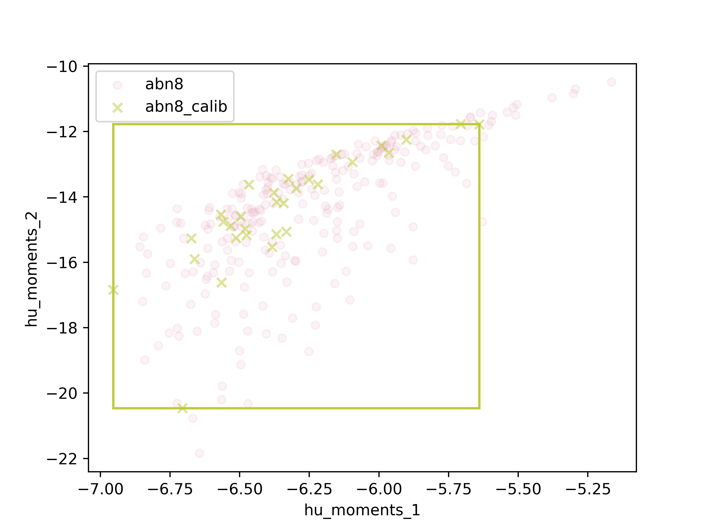
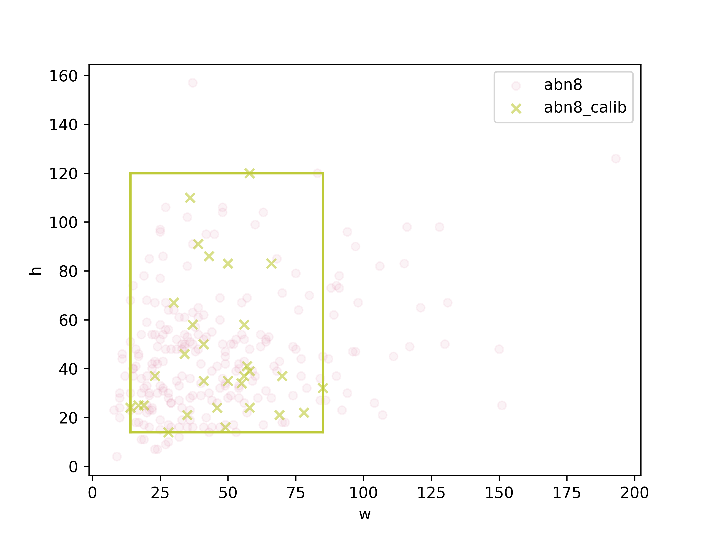
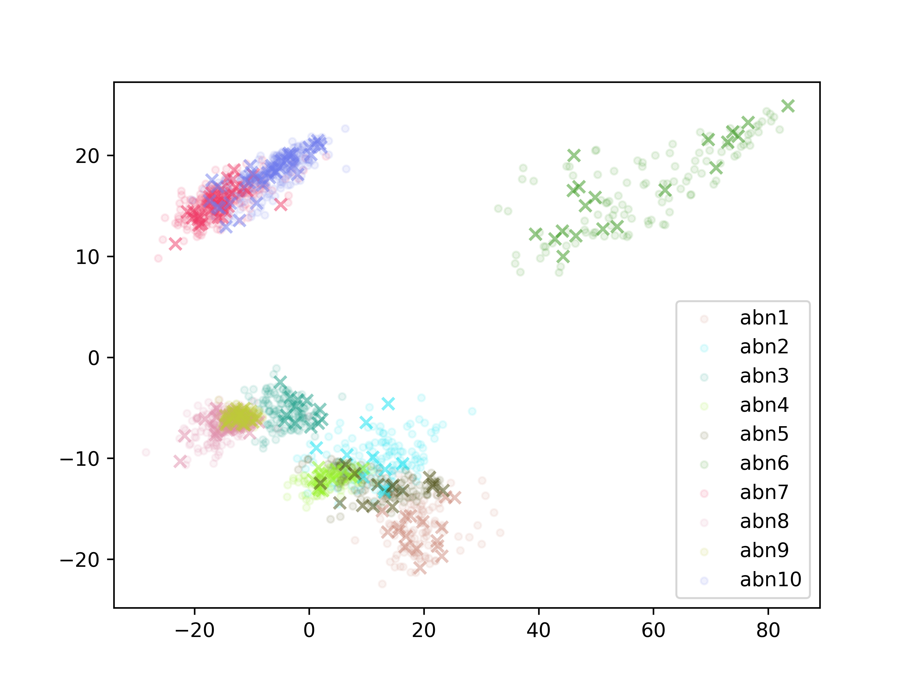

# calib-dataset-eval
During the PTQ(Post-training Quantization) process, a calibration dataset is necessary and important.
How to select the calibration dataset will affect the performance directly.
This repo aims to provide a tool to evaluate the calibration dataset before quantization.

Besides, this repo also can be used to visualize the image dataset distribution for both training set and validation set.

## Major features
- **Input image distribution**
  
    Calculate and visualize Hu moments distribution of training dataset and calibration dataset.

- **Output result distribution**
  
    Calculate and visualize the features distribution of training dataset and calibration dataset.

- **Intermediate feature distribution**

    Calculate and visualize the labels distribution of training dataset and calibration dataset.


## Background
As we know, during the quantization process, a calibration dataset is necessary.
The size of calibration dataset depends on tasks and models.
In other words, different type of tasks or model structures need different samples amount for calibration.

There are two main reasons for the bad result of quantization.
One is caused by the calibration dataset which doesn't cover the major distribution of training dataset.
The other one is caused by model structure which is not suitable for quantization ([Please refer to Quantizing deep convolutional networks for efficient inference: A whitepaper](https://arxiv.org/pdf/1806.08342.pdf)).

For the calibration dataset selection, let us take TensorRT as an example.
In TensorRT developer guide, it mentioned that experiments indicate that about 500 images are sufficient for calibrating ImageNet classification networks.
However, how many images do the calibrator needed for other tasks or networks?
If someone obtained an unsatisfying quantization result, how to check whether it was caused by the calibration dataset reason or not?

This repo aims to provide a tool to evaluate the calibration dataset before quantization.
This tool evaluate the calibration dataset from three aspects (or levels): 
From the input level (input image), we calculate and campare the Hu moments distribution between training set and calibration set. 
For the output level (output result), we compare label distribution of each bonding box between training set and calibration set. 
For the intermediate level (intermediate feature), we calaulate and compare the features (embeddings) between training set and calibration set.

## Requirement
- sklearn     
- opencv-python>=4.4.0.46     
- Pytorch 1.7 (recommend)
- mmcv>=1.2.4 <1.3 
- https://github.com/open-mmlab/mmdetection or https://github.com/grimoire/mmdetection-to-tensorrt
- COCO API (if dataset format is COCO)


## Getting start
git clone and build the docker
```shell
git clone https://github.com/shiyongming/calib-dataset-eval.git
cd calib-datasetapi-eval
docker build -t calib-datasetapi-eval:v0.1 docker/
```

Evaluate Hu moments ([Please refer to image moment](https://en.wikipedia.org/wiki/Image_moment#cite_note-%E2%80%9Chu-1)) distribution
```python
python visualization/visualization_humoments.py 
    -d <dataset_format> # 'coco' or 'voc'
    -t <path/of/train.txt>  # usually in VOC2007/ImageSets/Main/ 
    -c <path/of/calibration_dataset.txt>  # format like train.txt
    -x <path/of/VOC2007/Annotations/>  # which contains .xml file
    -tj <path/of/json/file> # json file of training set for COCO format
    -cj <path/of/json/file> # json file of cailbration set for COCO format
    -cp <1~100> # split percentage of calib_json for calib. only spport coco format.
    -ti <prefix/or/root/of/training/image/file>  # (optional) prefix before image 'filename'
    -ci <prefix/or/root/of/calibration/image/file> # (optional) prefix before image 'filename'
    -p <class index>  # which class you want to plot for visualization
```
 


Evaluate weight and height (label) distribution
```python
python visualization/visualization_wh.py
    -tt <path/of/train.txt>  # usually in VOC2007/ImageSets/Main/ 
    -ct <path/of/calibration_dataset.txt>  # format like train.txt 
    -x <path/of/VOC2007/Annotations/>  # which contains .xml file 
    -tj <path/of/json/file> # json file of training set for COCO format
    -cj <path/of/json/file> # json file of cailbration set for COCO format
    -cp <1~100> # split percentage of calib_json for calib. only spport coco format.
    -p <class index>  # which class you want to calculate and visualize
``` 
 

Extract feature embeddings
```python
python tools/extract_features.py 
    <path of mmdet config file> 
    <path of mmdet checkpoint file> 
    -t <path/of/VOC2007/.txt file> # which contains image list
    -x <path/of/VOC2007/Annotations/> # which contains .xml file
    -i <image root> # prefix of the 'filename' item in .xml file
    -l <layer number> # which layer of feature embedding you want to extract (count from back to front)
    -s <boolean> # save the extracted embeddings
```

Evaluate intermediate features (embeddings) distribution
```python
python visualization/visualization_features.py
    -tf <numpy file which contains trainset embeddings>,
    -tn <numpy array which contains trainset embeddings>,
    -tl <numpy file which contains trainset labels>, # -tl only can be set when each image only contains one label
    -cf <numpy file which contains calibset embeddings>,
    -cn <numpy array which contains calibset embeddings>,
    -cl <numpy file which contains calibset labels>, # -cl only can be set when each image only contains one label
    -d <visualization dimension>
```
